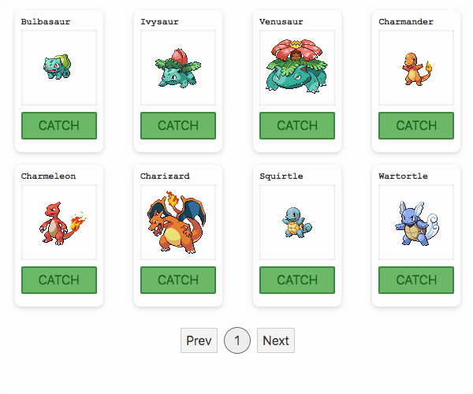

## svelte-paginate-store

A package that adds pagination to your data and makes it easily accessible using the **store** functionality from 'svelte/store'.

## Motivation

Hey! My name is Steven, nice to meet you!

I've really enjoyed working with Svelte and wanted to contribute to the community in some way, this is a package that I built for an ecommerce project (gallery of products) and I hope it will be of use to you.

Also this is my 🎉🎉🎉 FIRST EVER 🎉🎉🎉 package released into the wild, feedback and contributions are most welcome!

## Build status


## Code style

Code is formatted with prettier.

[](https://github.com/prettier/prettier)

Emojis are for visual pleasure (not obligatory):

Build 🏗️
Test 🔬
Edit 🖊️

## Screenshot



## Framework

<b>Built with</b>

- [Svelte](https://svelte.dev) - Cybernetically enhanced web apps.

## Features & Code

### Paginate Data and Store Creation

./src/store.js

```
import { paginateStore } from 'svelte-paginate-store'

// Fetch data from database or API
const data = [{ id: 1 }, { id: 2 }, { id: 3 }, { id: 4 }]

const options = {
  store: true,
  currentPage: 1,
  perPage: 2
}

export const users = paginateStore(data, options)
```

### Pagination Management

./src/index.svelte

```
<script>
  import { users } from './store.js

  $: console.log($users)

  // $users has access to paginated data via auto-subscription
  // #=> [{ id: 1 }, { id: 2 }]

  // users has access to the core pagination methods below
  const { prevPage, nextPage, goToPage, updatePerPage } = users

  nextPage() // $users => [{ id: 3 }, { id: 4 }]

  prevPage() // $users => [{ id: 1 }, { id: 2 }]

  goToPage(2) // $users => [{ id: 3 }, { id: 4 }]

  updatePerPage(4) // $users => [{ id: 1 }, ..., { id: 4 }]
</script>
```

### Store Management

./src/index.svelte

```
<script>
  import { users } from './store.js

  ...

  // users has access to a store (see below)
  // and the addToStore method for store management
  const { store, addToStore } = users

  $: console.log(store)

  // store has access to all users data
  // #=> [{ id: 1 }, { id: 2 }, { id: 3 }, { id: 4 }]

  // Fetch data from database or API
  const data = [{ id: 5 }, { id: 6 }]

  addToStore(data) // store => [{ id: 1 }, ..., { id: 6 }]
</script>
```

### Default Options

```
  const defaultOptions = {
    store: false,
    currentPage: 1,
    perPage: 4
  }

  export const store = paginateStore([], defaultOptions)

  /***
    $store => {
      store: null,
      currentPage: 1,
      perPage: 4,
      totalPages: 0,
      from: 0,
      to: 0,
      data: []
    }
  ***/
```

## Installation

```
yarn add -D svelte-paginate-store
```

```
npm i -D svelte-paginate-store
```

## Tests

```
yarn test
```

```
npm run test
```

## Contribute

Contributions are most welcome.

Open Issues with as much detail as possible ie. the expected behaviour, what is going wrong and steps to reproduce the issue.

Create Pull Requests that clearly describe the problem and solution.

## Credits

[Package creation with Rollup](https://risanb.com/posts/bundling-your-javascript-library-with-rollup/) - extremely helpful when building a package for the first time.

## License

MIT © Steven Rico
